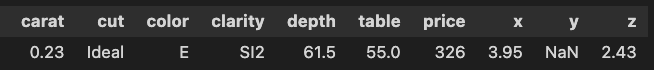
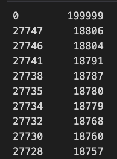
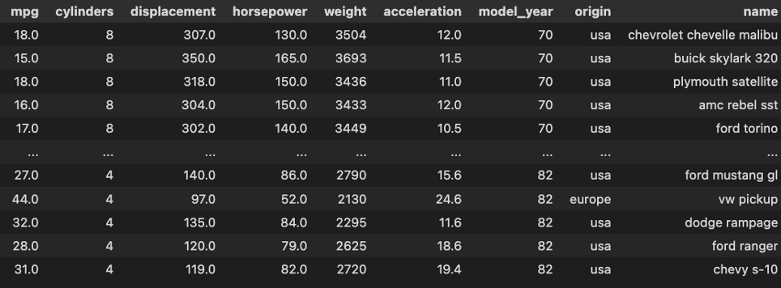
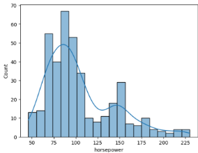
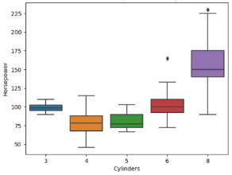
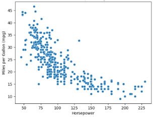
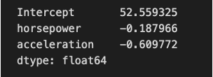
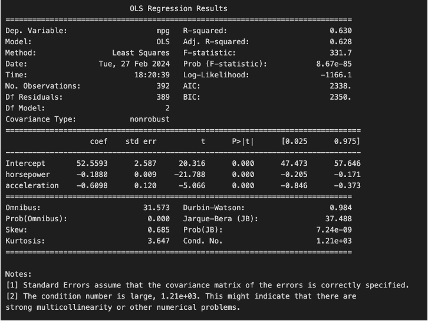
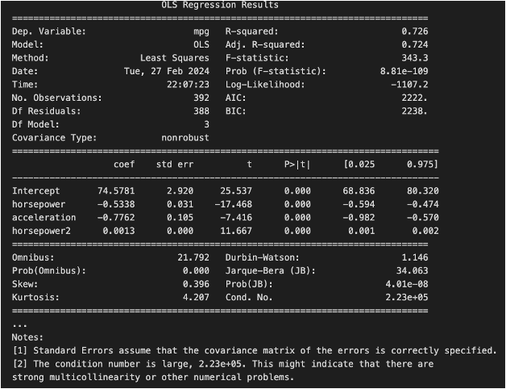
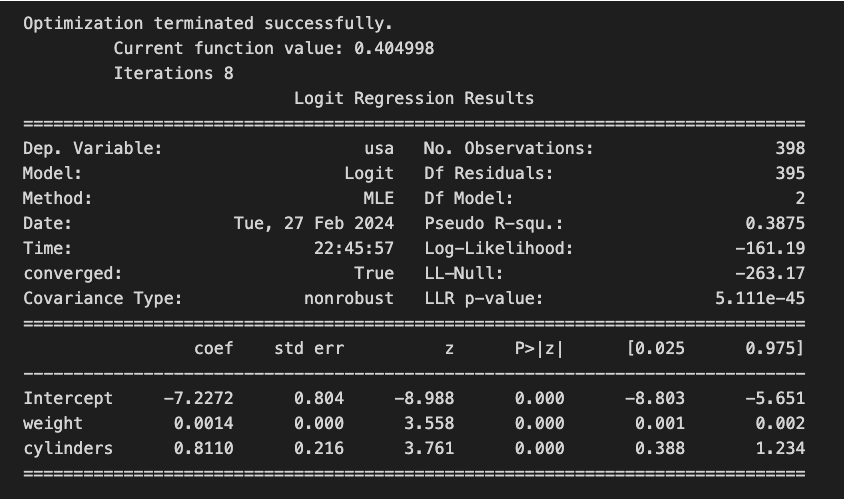

# Midterm Economic Modelling and Simulation
## Instructions
* There is one and only one correct answer per question
* Fill out the answers sheet: only that sheet will be graded
* You will need to return the question sheets, but whatever you write on it will be disregarded
* All questions are worth the same
* Correct answers are worth +1
* Wrong answers are worth -1
* If you are unsure about an answer, leave it blank and it will be worth zero
* For the sake of readability, the semicolon `;` has been used to combine several lines of code into a single one, when appropriate

## Questions
1. How would you measure the accuracy of a classification problem (e.g. diagnosing a disease) when using logistic regression?

- a) Dividing the true positives by the true negatives
- b) Dividing the true positives by the false positives
- c) Dividing the sum of the true positives and the true negatives by the total number of cases
- d) Dividing the sum of the false positives and the true negatives by the sum of the true negatives 

2. Choose the right import statement of the ‘car_crashes’ dataset from the `seaborn` package:
- a) `import seaborn as sns; df = sns.load_dataset('car_crashes')`
- b) `from seaborn import car_crashes`
- c) `import seaborn as pd; car_crashes = sns.get_dataset_names('pandas')`
- d) `import diamonds from seaborn`

We will now work with a dataset called `diamonds`. It contains properties of diamonds such as the `depth`, the `price`, the `color`, etc. of a collection of diamonds.

3. In order to get the column names of the ‘diamonds’ dataset, the proper command is:

- a) `diamonds.columns`
- b) `diamonds.names`
- c) `diamonds.values`
- d) `diamonds[columns]`

Below you can find a sample of the `diamonds` dataset:


4. Which command would subset the dataset ‘diamonds’ when the price is lower than 300:
- a) `diamonds.query("price > 300")`
- b) `diamonds.query("cut == Ideal")`
- c) `diamonds.query("price == 300")`
- d) `diamonds.query("price < 300")`

5. Now we decided to look at the price statistics when the `cut` variable equals `Ideal` using the following filter:
`diamonds.query("cut == 'Ideal'")['price'].describe()`. Based on the output, which is the median price when cut is 'Ideal'?


- a) `3456.5`
- b) `326.0`
- c) `1810.0`
- d) `4678.5`

6. We want to understand how many diamonds have color `E`, how many have color `J`, and so on. Which command achieves this?
- a) `diamonds.color.value_counts()`
- b) `diamonds.value_counts().color`
- c) `diamonds.color_values()`
- d) `diamonds.value_counts(color)`

7. Based on the summary statistic of Question 5, where would the value corresponding to the 30th percentile be?
- a) Below than `326`
- b) Between `326.0` and `878.0`
- c) Between `4678.5` and `18806.0`
- d) Between `878.0` and `1810.0`

8. Now we want to subset the dataset by the 2 first indexes. The command would be:
- a) `diamonds.loc[0:2]`
- b) `diamonds.query(“0:2”)`
- c) `diamonds.iloc[0:2]`
- d) `diamonds - 0:2`

9. Create a column named `volume` based on the dimensions `x`, `y` and `z` of the diamonds:
- a) `diamonds["volume"] = diamonds["x"] ** diamonds["y"] ** diamonds['z']`
- b) `diamonds["volume"] = product(diamonds["x"] * diamonds["y"] * diamonds['z'])`
- c) `diamonds.volume = diamonds["x"] + diamonds["y"] + diamonds['z']`
- d) `diamonds = diamonds.assign(volume = lambda df: df.x * df.y * df.z)`

10. Obtain a descriptive analysis of the `price` column that includes the number of elements, quantiles, etc:
* a) `diamonds.price.stats()`
* b) `diamonds.price.describe()`
* c) `diamonds[‘price’].analyse()`
* d) `diamonds.price`

11. Below is one row extracted from the `diamonds` dataset. What would be the result of the sum of columns `x` and `y` for this row? 
- a) `NaN`
- b) `3.95`
- c) `0`
- d) `6.38`



12. Which of the following charts display a histogram of the `price` variable?


- a) the left one
- b) the one in the center
- c) the right one
- d) none

13. Based on the above histogram, which is the most frequent price range?
- a) Between 7500 and 10000
- b) Between 17500 and 20000
- c) Between 5000 and 7500
- d) Between 0 and 2500

14. Which of the following best defines the term "Least Squares" in the context of statistical modeling?
- a) A method for minimizing the sum of squared differences between observed and predicted values
- b) A technique used to maximize the variance between data points
- c) A statistical approach focused on maximizing the absolute differences between observed and predicted values
- d) A method that prioritizes minimizing the maximum deviation between observed and predicted values

15. Choose the right definition of the the LeastSquares function that returns the intercept and slope after getting as arguments an `x` and `y` vectors:
- a)
```{python}
def LeastSquares(xs, ys):
      mean_x = np.mean(xs)
      mean_y = np.mean(ys)
      cov = np.dot(xs - mean_x, ys - mean_y) / len(xs)
      slope = cov
      inter = mean_y - slope * mean_x
      return inter, slope
```
- b)
```{python}
def LeastSquares(xs, ys):
      mean_x = np.mean(xs)
      var_x = np.var(xs)
      mean_y = np.mean(ys)
      inter = mean_x / mean_y
      slope = mean_x - var_x
      return inter, slope
```
- c)
```{python}
def LeastSquares(xs, ys):
      mean_x = np.mean(xs)
      var_x = np.var(xs)
      mean_y = np.mean(ys)
      cov = np.dot(xs - mean_x, ys - mean_y) / len(xs)
      slope = cov / var_x
      inter = mean_y - slope * mean_x
      return inter, slope
```
- d) None are correct

16. The above function is applied to the ‘carat’ and ‘price’ columns in order to find a correlation between them:
`inter, slope = LeastSquares(diamonds.carat, diamonds.price)`. Based on the above estimated intercept & slope for the columns `carat` and `price`, select that command that builds a column called `fit_carat` that contains the model fit for `price` for the data points in the dataset:

- a) `diamonds["fit_carat"] = inter * diamonds['carat'] * slope`
- b) `diamonds["fit_carat"] = inter * diamonds['carat'] + slope`
- c) `diamonds["fit_carat"] = inter + slope * diamonds['carat']`
- d) `diamonds["fit_carat"] = inter + slope + diamonds['carat']`

17. Which of the following is correct?
* a) The residuals are the differences between the observed values and the mean of the dependent variable.
* b) The residuals are the sum of the observed values and the predicted values
* c) The residuals of a linear model are the differences between the observed values and the values predicted
* d) The residuals are the differences between the predicted values and the mean of the independent variable.

18. Now we want to define a function that is capable to estimate the residuals of the linear fit. Select the correct definition:

* a) ```{python}
  def Residuals(xs, ys, inter, slope):
      xs = np.asarray(xs)
      ys = np.asarray(ys)
      res = ys - (inter + slope * xs)
```
* b) ```{python}
  def Residuals(xs, inter, slope):
      xs = np.asarray(xs)
      res = (inter + slope * xs)
      return res
```
* c) ```{python}
  def Residuals(xs, inter):
      xs = np.asarray(xs)
      res = xs - inter
      return res
```
* d) None is correct

19. Select the correct code-snippet that would allow to draw a scatterplot that includes `price` in the y-axis, and `carat` in the x-axis; plotting both the actual dataset and the fits:

* a) ```{python}
  plt.scatter(x=“carat”, y="price", data=diamonds, color="blue", label="carat")
  plt.scatter(x="carat", y="fit_carat", data=diamonds, color="cyan", marker="s")
  plt.xlabel("carat")
  plt.ylabel("price")
  plt.legend()
```
* b) ```{python}
  plt.scatter(x=“price”, y="carat", data=diamonds, color="blue", label="carat")
  plt.scatter(x=“fit_carat", y="carat", data=diamonds, color="cyan", marker="s")
  plt.xlabel("carat")
  plt.ylabel("price")
  plt.legend()
```
* c) ```{python}
  plt.line(x=“price”, y="cut", data=diamonds, color="blue", label="carat")
  plt.line(x=“fit_carat", y="cut", data=diamonds, color="cyan", marker="s")
  plt.xlabel("carat")
  plt.ylabel("price")
  plt.legend()
```
* d) None is correct

20. What function would you use to store the above `plt` object as a .png figure?
* a) `plt.storefig(f”{directory}/scatter.png”)`
* b) `df.savefig(f”{directory}/scatter.png”)`
* c) `plt.storefig()`
* d) `plt.savefig(f”{directory}/scatter.png")`

21. Choose which is the correct definition of an outlier in the data: (B)

* a) An outlier is any value in a dataset that is larger than the mean, indicating a superior significance in the analysis.
* b) An outlier is an observation that significantly deviates from the overall pattern of a dataset, often falling far outside the expected range of values.
* c) An outlier is an observation that perfectly fits the trend of a dataset, contributing to the overall consistency of the data.
* d) An outlier is the most common value in a dataset, representing the typical or average observation.

22. The following command obtains the 10 largest price numbers of the diamonds dataset when `cut` variable equals to `Ideal`:
`diamonds.query(“cut == ‘Ideal’”).nlargest(10, ‘price’).loc[:, ‘price’])`. Would you say, based on the figure below, that there is an outlier?



* a) No, because all the values are above 18000, meaning there is no deviation from the reference
* b) No, because the values are in the 18000-20000 range
* c) Yes, because the first value is one magnitude order larger than the others
* d) Yes, because the last value is significantly lower than the first one

23. The variance is a summary statistic used to:
* a) Describe the central tendency of the distribution.
* b) Describe the median of the distribution.
* c) Describe the errors of a distribution.
* d) Describe the variability of a distribution.

24. What’s the correct formula of the mean statistic?
* a) $\bar{x} = \frac{1}{n-1}\sum_{i=1}^{n}x_i$
* b) $\bar{x} = \frac{1}{n}\sum_{i=1}^{n-1}x_i$
* c) $\bar{x} = \frac{1}{n}\sum_{i=1}^{n}x_i$
* d) $\bar{x} = \frac{1}{n}\sum_{i=0}^{n}y_i$

25. The standard deviation can be conceived as: (B)
* a) The mean of the absolute differences from the mean.
* b) The squared root of the variance.
* c) The triple power of the variance.
* d) The mean divided by the population size.

In the following questions we will be using the dataset `mpg` from the seaborn package. Here is a sample:



26. We want to create a binary variable where cars originated in `usa` are encoded as `1` and cars originated elsewhere are encoded as `0`. This variable will be called `is_usa`. The correct command is:
* a) `mpg[‘is_usa’] = (mpg.origin == ‘usa’) * 1`
* b) `mpg[‘is_usa’] = ‘usa’ * 1`
* c) `mpg[‘is_usa’] = ‘usa’ * 0`
* d) `mpg[‘is_usa’] = (mpg.origin = ‘usa’) not in 'country'`

27. Select the plot that shows the distribution of ‘horsepower’ for each ‘cylinder’:





* a) Left
* b) Center
* c) Right
* d) None is correct

28. Based on the above charts, what type of *approximate* statistical relationship appears to be the one between the variable `horsepower` and `cylinder`? 
* a) Linearly decreasing: horsepower decreases with the numbers of cylinders since they are less efficient in distributing the power.
* b) Normally distributed: horsepower reaches its peak at 80 cylinders.
* c) Non-linearly growing: horsepower increases with the number of cylinders.
* d) Non-linearly growing: horsepower decreases from 50 to 225 as the number of cylinder increases.

29. Is there a linear relationship between ‘mpg’ & ‘horsepower’ based on the charts ?
* a) Yes, data follows a perfect linear trend.
* b) No, data seems to follow a non-linear declining trend.
* c) No, data follows an exponential uptrend.
* d) Yes, since there is a constant decline on the miles per gallon as the horsepower increases.

30. What distinguishes multiple linear regression from simple linear regression?
* a) Multiple linear regression is always more accurate than simple linear regression.
* b) Simple linear regression can handle categorical variables, while multiple linear regression cannot.
* c) Multiple linear regression does not work with small datasets.
* d) Multiple linear regression involves more than one independent variable, while simple linear regression involves only one.

31. Now we want to study the impact of the variables `horsepower` and `acceleration` on the miles per galloon `mpg`. What formula would you use?
* a) `acceleration ~ mpg + horsepower`
* b) `horsepower ~ mpg + acceleration`
* c) `mpg ~ horsepower + acceleration`
* d) `y ~ mpg + horsepower + acceleration`

32. We have fitted the above model with the `smf.ols` function from the `statsmodel` package. Choose the correct statement that defines the formula for the multiple linear regression:



* a) `f(horsepower, acceleration) = 52,55*inter + 0,18·horsepower + 0,6·acceleration`
* b) `f(mpg, acceleration) = -52,55 + 0,18·mpg + 0,6·acceleration`
* c) `f(horsepower, acceleration) = 52,55 + 0,18·horsepower + 0,6·acceleration`
* d) `f(horsepower, acceleration) = 52,55 - 0,18·horsepower - 0,6·acceleration`

33. Select the correct statement to interpret the formula that evaluates the influence of ‘horsepower’ and ‘acceleration’ over ‘mpg’.
* a) For every one-unit increase in acceleration, while also increasing horsepower, the predicted `mpg` is expected to decrease by 0.6 units.
* b) For every one-unit increase in acceleration, holding horsepower constant, the predicted `mpg` is expected to decrease by 0.6 units.
* c) For every one-unit increase in horsepower, holding acceleration constant the predicted `mpg` is expected to increase by 0.18 units.
* d) For every one-unit increase in the intercept, the horsepower causes `mpg` to increase by 52.559 units.

34. Which statistical descriptor would you use to evaluate whether one particular regressor in a multiple regression model is significant?
* a) R-squared
* b) p-value
* c) AIC
* d) Standard Error

After training the model we have obtained the statistical summary shown in the figure to evaluate its goodness.



35. Assuming a significance level of 0.05, select the correct statement regarding the coefficient of each variable:
* a) Both variables have a large p-value and thus their coefficient is assumed to be 0.
* b) `horsepower` has a low p-value while `acceleration` has a large p-value, therefore only `horsepower` can be considered significant.
* c) Both variables have a low p-value and therefore their coefficients are both significant.
* d) `horsepower` has a high p-value while `acceleration` has a low p-value, therefore only `acceleration` can be considered.

36. What does R-squared (coefficient of determination) measure in the context of a linear regression model?
* a) The proportion of the variance in the dependent variable explained by the independent variable(s).
* b) The accuracy of the model in predicting future observations.
* c) The percentage of datapoints correctly predicted by the model.
* d) The relation between the dependent variables.

37. Based on the R-squared of the fitted model, which of the following statements is correct?
* a) The R-squared value indicates that our model captures 0.63% of the relationship between variables
* b) The R-squared value indicates that our model captures 63% of the relationship between variables
* c) The R-squared value indicates that our model is significant with 63% confidence
* d) The R-squared value indicates that our model captures 63% of the variables that are relevant

38. When we add meaningful, independent features to a multiple linear regression:
* a) The residuals start to capture the non-linear trend underlying the model
* b) The performance of the model decreases initially, and then increases
* c) The heteroskedasticity of the residuals starts to increase
* d) The performance of the model usually improves, at least for a few additional features

We suspect that the relationship of `mpg` with `horsepower` does not follow a linear relationship but rather non-linear one.

39. Create a variable named ‘horsepower2’ that captures this quadratic behavior. The correct command is:
* a) `mpg[‘horsepower2’] = np.sqrt([‘horsepower’])`
* b) `mpg = mpg.assign(horsepower2 = mpg.horsepower ** 2)`
* c) `mpg = mpg.assign(horsepower2 = mpg.horsepower x 2)`
* d) `mpg[‘horsepower2’] ** 2`

40. Which would be the new formula of the regression also considering this quadratic term?
* a) `mpg ~  horsepower * horsepower2 + acceleration`
* b) `mpg ~ mpg + horsepower + horsepower2`
* c) `mpg + horsepower2 ~ mpg + acceleration`
* d) `mpg ~ horsepower + horsepower2 + acceleration`

After training this modified (quadratic) version of the model we have obtained the statistical summary to evaluate its goodness.



41. Which of the following statements regarding the newly fitted model is true?
* a) With the quadratic term the model fits the data better than without it
* b) The quadratic term coefficient can be ignored since the p-value is not significant
* c) `horsepower` becomes meaningless because its p-value is zero
* d) The overall performance of the model slightly deteriorates

42. In the formulation of logistic regression, what is the primary purpose of using odds instead of probabilities?
* a) To model linear relationships between unbounded independent and dependent variables
* b) To increase the accuracy of the model in predicting categorical outcomes
* c) To deal with outliers in data
* d) To ensure that the output is bounded between 0 and 1

43. We now want to build a logistic regression model that takes the `weight` and the number of `cylinders` of the car as regressors and predicts whether a car was likely to be have been manufactured in the US (versus in the rest of the world). The command that will create the model is:
* a) `model = smf.ols(“is_usa ~ weight + cylinders", data=mpg)`
* b) `model = smf.logit("weight ~ is_usa + cylinders", data=mpg)`
* c) `model = smf.logit("is_usa ~ weight + cylinders", data=mpg)`
* d) `model = smf.ols(“weight ~ is_usa + cylinders", data=mpg)`



We have trained the model and obtained the statistical summary of the attached figure.

44. Which of the following can be derived from the results?
* a) The more cylinders a car has, the less likely it is American
* b) "The heavier the car, the more likely it is American" is the clearest insight
* c) The less cylinders a car has, the less likely it is American
* d) The probability of the car being American increases with the acceleration

45. Based on the p-values:
* a) Only the weight has explanatory power
* b) Both the weight and the cylinders have explanatory power
* c) Only the cylinders have explanatory power
* d) Neither the cylinders or the weight have explanatory power

46. Suppose a friend of yours is pregnant and you want to predict whether the baby is a boy or a girl. What model would you use?
* a) Linear regression
* b) Logistic regression
* c) Poisson regression
* d) Ordinary Least Squares

47. Imagine that this friend is interested in understanding whether being a first-time mom plays a significant role in the weight of the baby. What would you tell her?
* a) It does not play a role if the logistic regression `weight ~ birth_order` has p-value of zero
* b) It might play a role, but it could also be conflated with the effect of the age 
* c) It might play a role, but only if the p-value of `age` is high enough
* d) It does not play a role as long as the regression `weight ~ birth_order + age` has a low `R-squared`

48. Which of the following is correct?
* a) If the probability of something happening is 20%, the odds are 2 to 1
* b) If the probability of something happening is 50%, the odds are 1 to 1
* c) If the probability of something happening is 25%, the odds are 1 to 4
* d) If the probability of something happening is 50%, the odds are 5 to 1

49. Which of the following is correct?
* a) A categorical variable ranges from 0 to 1
* b) A numerical variable ranges from -1 to 1
* c) A categorical variable takes discrete values
* d) A numerical variable takes discrete values

50. Suppose you want to predict house prices based on features such as square footage, number of bedrooms, and number of bathrooms. What model would you use?
  * a) Poisson regression
  * b) Logistic regression
  * c) Multiple linear regression
  * d) Heteroskedasticity
